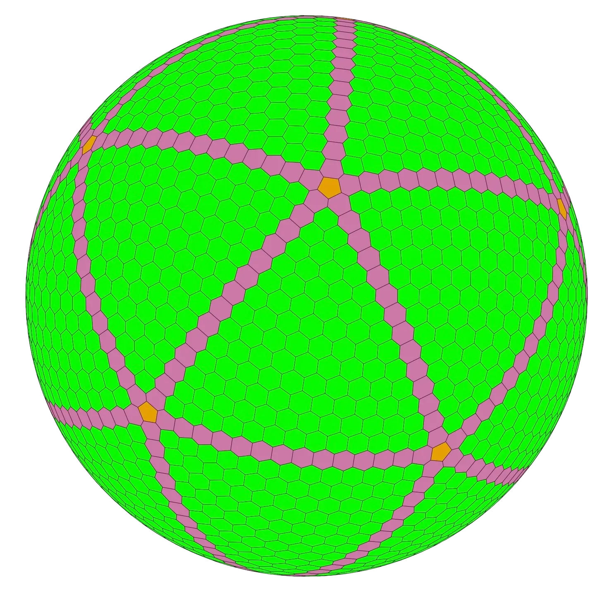

# Uniform Geodesic Grid

## Overview

`uniform-geodesic-grid` is a Node.js command-line tool for generating a homogeneous hexagonal geodesic grid, specifically designed for geostatistical applications. The tool produces well-behaved grids that maintain uniform spacing across the globe (~20% variance in cell area), based on the algorithm developed by Philippe Rivière. For more details on the algorithm, please refer to Rivière's [notebook on Observable](https://observablehq.com/@fil/gray-fuller-grid).

The tool outputs a GeoJSON `FeatureCollection` containing the grid cell geometries. Included cell properties are

- `gid`, the unique cell id
- `lon` and `lat`, the coordinates of the cell centroid
- `neighbors`, the list of adjacent cell ids
- `icosahedron_placement`, one of "vertex", "edge", or "face", depending on where the cell is located with respect to the geodesic icosahedron used to project the points



## Installation

To install the tool, use npm to install directly from the GitHub repository:

```bash
npm install -g https://github.com/tzakharko/uniform-geodesic-grid
```

## Usage

After installation, the tool can be used via the command line. Below are the basic usage instructions:

### Basic Command

```bash
uniform-geodesic-grid [options]
```

### Options

- `--cell-size <km>`: Specifies the target median cell diameter in kilometers. The value must be between 40 and 7400 km. This option is mutually exclusive with `--k`.

- `--k <subdivisions>`: Sets the number of triangle edge subdivisions for grid generation. Must be a positive integer up to 250. This option is mutually exclusive with `--cell-size`.

- `--pretty`: Pretty-formats the JSON output for easier readability.

### Examples

1. **Generate a grid with a specific cell size:**

   ```bash
   uniform-geodesic-grid --cell-size 100
   ```

   This command generates a grid with a target median cell diameter of 100 km. Note that the actual cell size might differ.

2. **Generate a grid with a specific number of subdivisions:**

   ```bash
   uniform-geodesic-grid --k 20
   ```

   This command generates a grid using 20 subdivisions of triangle edges.

3. **Generate a grid with pretty-formatted JSON output:**

   ```bash
   uniform-geodesic-grid --cell-size 100 --pretty
   ```

   This command generates the grid and outputs the GeoJSON in a more readable format.

## Algorithm Description

The tool generates a geodesic grid by first placing equally spaced points on the faces of a planar icosahedron. These points are then backprojected onto a spherical surface to form a geodesic icosahedron. The grid cells are created by constructing a Voronoi diagram of these backprojected points, resulting in a homogeneous hexagonal grid. This method ensures uniform spacing and consistent cell shapes, making it ideal for geostatistical applications.

The algorithm follows the approach outlined by Philippe Rivière, utilizing the Gray-Fuller projection to maintain geometric accuracy during the transformation from the plane to the sphere.

## Acknowledgments

This tool is based on and reproduces the work of Philippe Rivière. For a more in-depth understanding of the algorithm and its mathematical foundations, please visit his [Observable notebook](https://observablehq.com/@fil/gray-fuller-grid).
